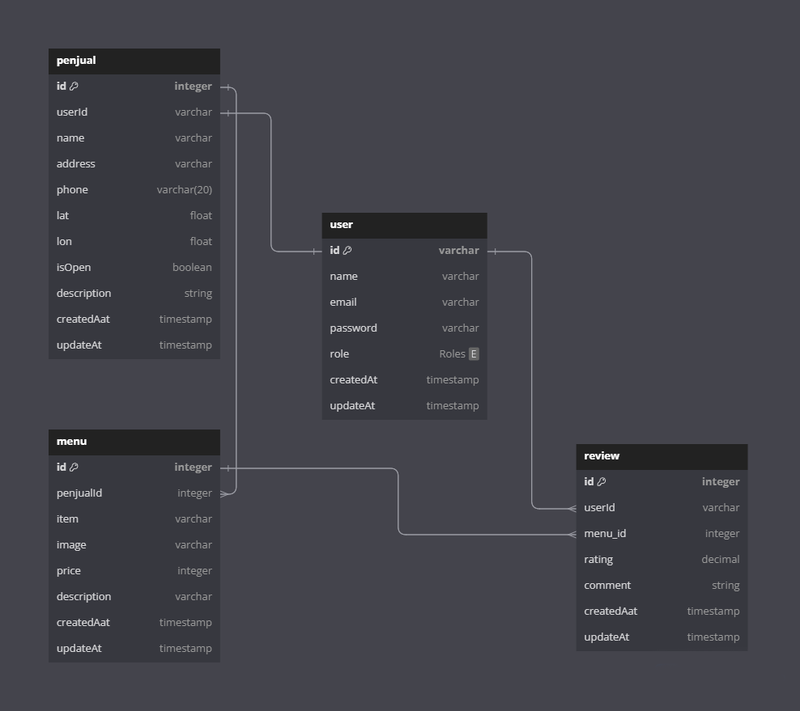
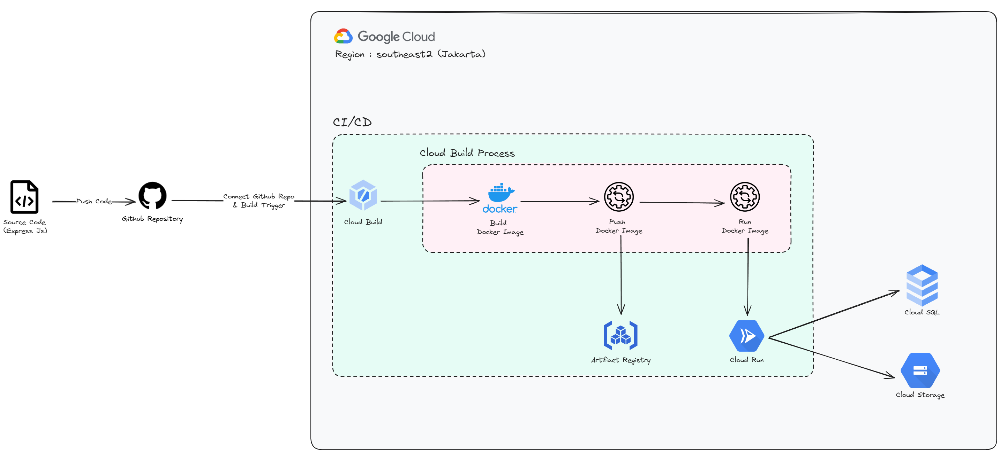

<h1 align="center">JajanJalan REST API</h1>
 

    Back-end implementation for our application
     
    <!-- <a href="https://github.com/entry-point-community/v6-app"><strong>Explore the docs »</strong></a>
      -->
     
    <a href="https://github.com/asyarbre/jajanjalan-api/issues">Report Bug</a>
    ·
    <a href="https://github.com/asyarbre/jajanjalan-api/issues">Request Feature</a>
  

<!-- TABLE OF CONTENTS -->
<h4>Table of Contents</h4>
<ol>
  <li>
    <a href="#about-the-project">About The Project</a>
    <ul>
      <li><a href="#built-with">Built With</a></li>
      <li><a href="#database-design">Database Design</a></li>
      <li><a href="#cicd-environment">CI/CD Environment</a></li>
    </ul>
  </li>
</ol>
<!-- ABOUT THE PROJECT -->

## About The Project
This is the back-end service repository for JajanJalan. These services provide the functionality and logic required to support the front-end of the JajanJalan application. These back-end services are responsible for handling tasks such as data storage, processing, and retrieval, as well as providing APIs to interact with the front-end.

### Built With
- NPM
- ExpressJs
- Prisma
- MySQL

### Database Design

### CI/CD Environment

For the CI/CD Environment, we use Cloud Build with push trigger. When a revision / update to the code is pushed, the diagram as shown above will run the process of revision. Below are the services we use from Google Cloud Platform to develop CI/CD pipeline :
1. Cloud Build : To create a trigger
1. Artifact Registry: For the docker images repository
1. Cloud Run: To run the application
